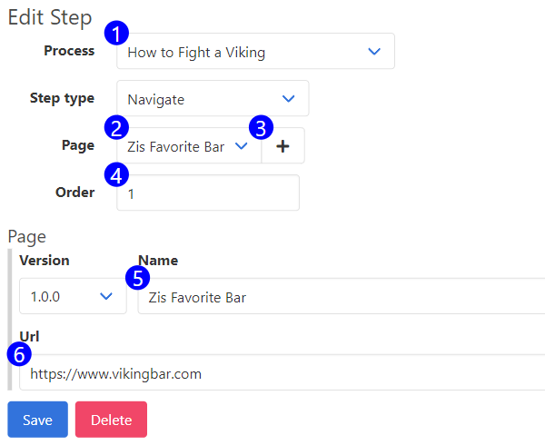

The Navigate Step type will navigate to the given URL in the browser. Selecting Navigate from the Step Type select input will cause the Navigation form to render, displaying these options:

1. **Type URL** - Selecting the type option will open a text input you can use to type in a URL to navigate to. This option is not recommended as UserDocs won't be able to associate elements to a page object, or determine what page you are on for the rest of the process.  This option may be deprecated in a future release.
2. **Page Select Input** - Use this dropdown to pick any page that exists in the project.
3. **Create Page** - Clicking the new page button will create a blank page, and empty the fields in the page sub form.
4. **Order** - This field will be deprecated. It shouldn't be used.
5. **Name** - A descriptive name for the page. Will be used in the UI.
6. **URL** - The URL for the page. This is the address that UserDocs will navigate to when the step is executed. Should be entered in the form protocol://address.com, like https://www.google.com

## Accessible at
`/steps/:id/edit`