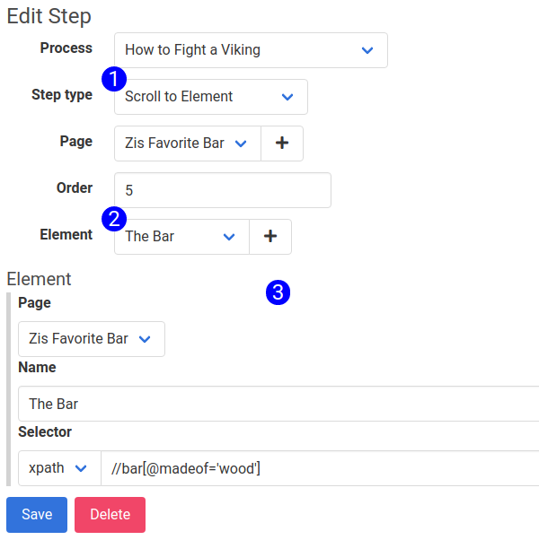

# Scroll to Element Step Form

The 'Scroll to Element' step type is used to scroll to a specific element into the viewport, setting the scene properly for a screenshot. Please note that this step will scroll the element to the top of the viewport by default. If there is a floating navbar or other floating elements, they may obscure the element to which you've scrolled. In that case, scroll to a preceding element.

To make a 'Scroll to Element' step, navigate to an existing or new step.

1. **Step Type Selector** - Use this input to pick the step type. Fields in the form will be exposed or hidden, based on the selected step type. To set up a 'Scroll to Element' step, select it here.
2. **Element Selector** - Use this input to select which element to scroll into view during the step.
3. **Element Subform** - The details about the element. Update this form and hit save to update the element. For more information on the Element Subform, see [this related article](element_subform.md)