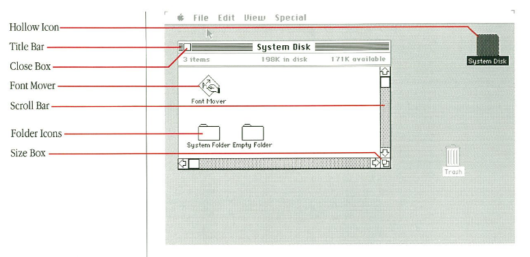

# UserDocs
## Automated Screenshot Collection for Web-Based Software

In 1983, Apple revolutionized the computing industry with the release of the Macintosh. With it, they released the first user manual we could find that included screenshots of their GUI. This manual included gems such as:

This was the first time most people would see an annotated screenshot of a computer application. If you thumb through [the manual](http://www.maccaps.com/MacCaps/DIY_Information_files/Macintosh_Manual_1984.pdf) you'll find hundreds of screenshots that someone manually collected, annotated, and included in the manual. 

Almost 40 years later, many technical writing teams have adopted the Docs as Code philosophy. We are tightly integrated with development teams. We ship docs to source control repos, and have comparably complex, flexible and automated deployment pipelines. Yet, most technical writers are still manually collecting and annotating screenshots.

The process of manual screenshot collection and annotation is incredibly monotonous and time-consuming. Every time the software changes, the screenshots are out of date, and must be updated. For companies that ship code rapidly, technical writers can feel like they are always behind as they update the documentation.

## Automate with UserDocs